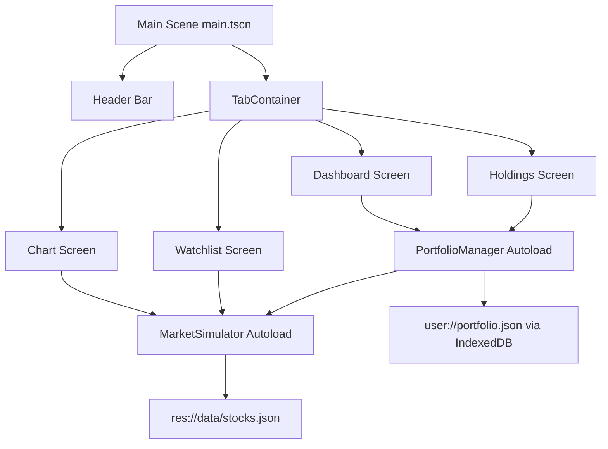

# Stonkport — Stock Portfolio Web App (Godot 4.x WASM)

## 1. Overview

A single-page stock portfolio web app where **all UI is rendered by Godot 4.x's Control node system**, exported to WebAssembly and embedded in an HTML page. Fully client-side: mock market data is generated by a built-in simulator, and portfolio state persists to the browser via `user://` (IndexedDB on web). No backend, no API keys.

**Core features**
- Portfolio dashboard: total value, cash, day change, total P&L, sector allocation donut
- Holdings management: add / edit / remove positions with buy/sell transaction history
- Live-ish price simulation (geometric random walk) with per-ticker volatility
- Candlestick chart with volume bars, crosshair, and timeframe switching (1D / 1W / 1M / 1Y)
- Watchlist with live prices
- Persistence to browser storage; demo portfolio seeded on first run


| Item | Choice | Notes |
|---|---|---|
| Engine | Godot 4.3+ (GDScript 2.0) | Installed at `Z:\Godot\Godot_v4.7.2-stable_win64\Godot_v4.7.2-stable_win64_console.exe` (v4.7.2 stable). Verify exact version with `godot --version` before export. Web export only supports the **GL Compatibility** renderer |
| UI | Godot Control nodes + custom `_draw()` | No HTML/CSS UI; Godot is the UI library |
| Export | HTML5 preset → `index.html`, `app.wasm`, `app.pck` | Requires Godot export templates installed |
| Data | `res://data/stocks.json` (embedded in pck) | Static stock universe |
| Persistence | `user://portfolio.json` via `FileAccess` | Maps to IndexedDB on web; `JavaScriptBridge`/localStorage as fallback |
| Serving | Static file server (`python -m http.server`) | WASM needs correct MIME types |

## 3. High-Level Architecture



**Autoload singletons** (registered in `project.godot`):

- `MarketSimulator` — owns the mock price engine. Loads the stock universe, maintains `current_prices` and synthetic OHLC `history`, emits `price_updated(ticker, price)` on each tick.
- `PortfolioManager` — owns portfolio state (cash, holdings, transactions, watchlist, settings), computes derived values (market value, P&L, allocation), and handles save/load. Reads prices from `MarketSimulator`.

## 4. Project Structure

```
Stonkport/
├── project.godot                  # Project config, autoloads, web-friendly window settings
├── export_presets.cfg             # HTML5 export preset
├── icon.svg
├── data/
│   └── stocks.json                # Stock universe: ticker, name, sector, base price, volatility
├── scenes/
│   ├── main.tscn                  # Root: header + TabContainer
│   ├── dashboard.tscn             # Summary cards + allocation donut
│   ├── holdings.tscn              # Holdings table + add/edit/remove
│   ├── chart.tscn                 # Ticker/timeframe selectors + candlestick chart
│   ├── watchlist.tscn             # Watchlist rows + add/remove
│   └── dialogs/
│       ├── position_dialog.tscn   # Add/edit position form
│       └── settings_dialog.tscn   # Refresh interval, currency, reset data
├── scripts/
│   ├── autoload/
│   │   ├── market_simulator.gd
│   │   └── portfolio_manager.gd
│   ├── ui/
│   │   ├── main.gd
│   │   ├── dashboard.gd
│   │   ├── holdings.gd
│   │   ├── chart_screen.gd
│   │   ├── watchlist.gd
│   │   └── position_dialog.gd
│   └── chart/
│       ├── candlestick_chart.gd   # Custom _draw() chart widget
│       └── donut_chart.gd         # Custom _draw() allocation donut
├── theme/
│   └── theme.tres                 # Dark theme: StyleBoxFlat, colors, fonts
├── web/
│   └── index.html                 # Optional custom HTML shell (loading bar, CSS)
├── build/web/                     # Export output (gitignored)
└── README.md                      # Setup, export, and run instructions
```

## 5. Data Model

**Stock universe** (`data/stocks.json`) — ~12–20 well-known tickers across sectors:

```json
{
  "AAPL": { "name": "Apple Inc.", "sector": "Technology", "base_price": 185.0, "volatility": 0.018 },
  "MSFT": { "name": "Microsoft Corp.", "sector": "Technology", "base_price": 415.0, "volatility": 0.016 }
}
```

**Portfolio save file** (`user://portfolio.json`):

```json
{
  "version": 1,
  "cash": 5000.0,
  "holdings": [
    { "ticker": "AAPL", "shares": 10, "avg_cost": 175.0 }
  ],
  "transactions": [
    { "id": "txn_1724...", "ticker": "AAPL", "type": "buy", "shares": 10, "price": 175.0, "timestamp": 1724000000 }
  ],
  "watchlist": ["AAPL", "MSFT", "NVDA"],
  "settings": { "refresh_interval_s": 5, "currency": "USD" }
}
```

**Derived values** (computed, never stored): market value = `shares * current_price`; position P&L = `(current_price - avg_cost) * shares`; portfolio P&L = sum of position P&L; day change = sum of `shares * (current_price - prev_close)`.

## 6. Market Simulator Design

`MarketSimulator` (autoload):

- `_ready()`: load universe from `res://data/stocks.json`; seed RNG with `Time.get_unix_time_from_system()` so each session differs; generate initial prices and a synthetic "prev close" per ticker.
- `tick()`: update every price with geometric Brownian motion:
  `price *= exp((mu - 0.5 * sigma^2) * dt + sigma * sqrt(dt) * randf_normal())`
  where `mu ≈ 0`, `sigma = volatility`, `dt = refresh_interval_s / 252 / 390` (per-tick scaling). Emit `price_updated`.
- `get_history(ticker, timeframe) -> Array[OHLC]`: generate synthetic bars on demand:
  - 1D → 5-minute bars (78 bars), 1W → 30-minute bars, 1M → daily bars, 1Y → daily bars.
  - Each bar derived from a seeded random walk anchored at the current price (last bar closes at current price).
- `get_price(ticker)`, `get_prev_close(ticker)`, `get_universe()`, `get_sector_allocation()` helpers.
- Uses a `Timer` node for the tick loop; interval from `PortfolioManager.settings`.

## 7. Persistence Strategy

- `PortfolioManager.save()`: serialize state to JSON, write to `user://portfolio.json` via `FileAccess.open(..., WRITE)`, then `flush()` + `close()`. On web, `user://` is backed by IndexedDB (Emscripten IDBFS) — no extra code needed.
- `PortfolioManager.load()`: if file missing or corrupt, seed a demo portfolio (e.g., $5,000 cash + 3 starter positions) and save.
- **Fallback**: if `FileAccess` fails on web (e.g., IndexedDB unavailable), use `JavaScriptBridge.eval("localStorage.getItem/setItem(...)")` guarded by `OS.has_feature("web")`.
- Save triggers: after any mutation (add/edit/remove position, watchlist change, settings change) and on `NOTIFICATION_WM_CLOSE_REQUEST`.

## 8. UI / Screens

Root scene `main.tscn`: full-rect `Control` → `MarginContainer` → `VBoxContainer`:

1. **Header bar** (`HBoxContainer`): app title, live total value, day P&L (green/red), refresh button, settings button.
2. **`TabContainer`** with four tabs:

| Tab | Contents |
|---|---|
| Dashboard | Summary cards (Total Value, Cash, Day Change, Total P&L) + sector allocation `DonutChart` + top movers list |
| Holdings | `Tree` table: Ticker, Name, Shares, Avg Cost, Price, Market Value, P&L, P&L% — plus Add / Edit / Remove buttons |
| Chart | `OptionButton` ticker + timeframe, `CandlestickChart` widget, price/volume tooltip |
| Watchlist | Scrollable rows: ticker, price, change%; add/remove tickers |

**Position dialog** (`position_dialog.tscn`): `LineEdit` ticker (validated against universe), shares, price; buy/sell `OptionButton`; on submit, `PortfolioManager` updates holdings + appends a transaction. Sell validation: cannot sell more shares than held.

**Settings dialog**: refresh interval slider, currency label (USD only for v1), "Reset to demo data" button.

## 9. Chart Rendering

`CandlestickChart` extends `Control`, renders in `_draw()`:

- Background grid: `draw_line` for horizontal price levels + vertical time lines.
- Candles: `draw_rect` (body, green/red by close vs open) + `draw_line` (wick).
- Volume bars: `draw_rect` at bottom, semi-transparent.
- Crosshair: track `gui_input` mouse motion; `draw_line` crosshair + `draw_string` tooltip (price, OHLC, volume) using a monospace `Font`.
- Axis labels: `draw_string` with `ThemeDB.fallback_font`; respect `get_window().content_scale_factor` for HiDPI crispness.
- Data source: `MarketSimulator.get_history(ticker, timeframe)`; redraw on timeframe/ticker change and on price tick (only the last bar updates live).

`DonutChart` extends `Control`: `draw_circle`/`draw_arc` segments per sector with legend labels.

## 10. Theme

`theme/theme.tres` — dark trading-app theme:

- Background `#0d1117`, panels `#161b22`, borders `#30363d`.
- Accent `#58a6ff`; P&L green `#3fb950`, red `#f85149`.
- `StyleBoxFlat` for `PanelContainer`, `Button`, `LineEdit`, `TabContainer` tabs.
- Monospace font for all numeric labels (default Godot font acceptable; optional bundled font file).
- Applied at root scene via `theme` property so all children inherit.

## 11. Web Export Configuration

`project.godot` key settings:

```ini
[application]
config/name="Stonkport"
run/main_scene="res://scenes/main.tscn"

[autoload]
MarketSimulator="*res://scripts/autoload/market_simulator.gd"
PortfolioManager="*res://scripts/autoload/portfolio_manager.gd"

[display]
window/size/viewport_width=1280
window/size/viewport_height=720
window/stretch/mode="canvas_items"
window/stretch/aspect="expand"

[rendering]
renderer/rendering_method="gl_compatibility"
renderer/rendering_method.mobile="gl_compatibility"
```

`export_presets.cfg`: one HTML5 preset named `Web` (export path `build/web/index.html`). Optional custom shell `web/index.html` for a loading bar and full-viewport CSS.

## 12. Build & Run

1. Install Godot 4.3+ and the **HTML5 export templates** (Editor → Manage Export Templates).
2. Open the project in the editor, run `F5` to test desktop mode first.
3. Export: `godot --headless --export-release "Web" build/web/index.html` (or via Editor → Export).
4. Serve: `cd build/web && python -m http.server 8080`, open `http://localhost:8080`.
5. Verify: UI renders, prices tick, add/edit/remove positions, refresh page → portfolio persists.

## 13. Implementation Checklist

- [x] Scaffold project: `project.godot` (autoloads, window/stretch, gl_compatibility), `icon.svg`, `theme/theme.tres`
- [x] Create `data/stocks.json` universe (12–20 tickers with sector, base price, volatility)
- [x] Implement `MarketSimulator` autoload: universe load, seeded random walk, tick timer, `get_history` OHLC generation, signals
- [x] Implement `PortfolioManager` autoload: state, derived values, transactions, save/load to `user://` with demo seed + web fallback
- [x] Build `main.tscn` shell: header bar + `TabContainer` + theme wiring
- [x] Dashboard screen: summary cards + `DonutChart` allocation + top movers
- [x] Holdings screen: `Tree` table + Add/Edit/Remove + `position_dialog.tscn` with validation
- [x] Chart screen: `CandlestickChart` `_draw()` widget (grid, candles, volume, crosshair, tooltip) + ticker/timeframe selectors
- [x] Watchlist screen: live price rows + add/remove
- [x] Settings dialog: refresh interval, reset demo data
- [x] `export_presets.cfg` HTML5 preset + optional custom `web/index.html` shell
- [x] Export to `build/web`, serve locally, verify persistence across reload
- [x] `README.md` with setup/export/run instructions

## 14. Risks & Mitigations

| Risk | Mitigation |
|---|---|
| Web export only supports GL Compatibility renderer | Set `gl_compatibility` in `project.godot` from day one; avoid shader-heavy effects |
| `user://` on web depends on IndexedDB | Test early; add `JavaScriptBridge`/localStorage fallback guarded by `OS.has_feature("web")` |
| HiDPI blurry custom drawing | Scale drawing by `content_scale_factor` |
| WASM download size | Vector drawing only, no large textures; default font; single pck |
| Random-walk prices look unrealistic | Tune volatility per ticker; anchor history last bar to current price |

## 15. Reference: Godot as an Embedded Library (libgodot)

**Local example:** `Y:\OpenSource\libgodot_example-master` (upstream: https://github.com/zorbathut/libgodot_example) — a working demo of embedding the Godot engine as a **linkable shared library inside a host C++ program** ("LibGodot"), instead of running the standalone player binary.

What it demonstrates:

- Builds Godot itself as a shared library (`godot/` submodule) plus matching `godot-cpp` bindings, then links a small C++ driver against both (`driver-cpp-shared/main.cpp`, built via `driver-cpp-shared/SConstruct`); the whole build + run is orchestrated by `runit-cpp-shared.py`.
- Boots the engine from host code through the C API: `libgodot_create_godot_instance(argc, argv, init_callback)` → `GodotInstance::start()` → per-frame `godot_instance->iteration()` loop → `libgodot_destroy_godot_instance(instance)`.
- Drives the scene tree directly from C++ with **no GDScript**: fetches the `SceneTree` from `Engine::get_singleton()->get_main_loop()` and updates a `Label` in the loaded scene every frame.
- Ships a minimal sample project (`project/project.godot`, `project/main.tscn`) that the driver launches with `--path project`.

Relevance to this plan:

- **Alternative delivery target**: the same Stonkport scenes / scripts / autoloads could be hosted inside a native application (a desktop shell, or embedded within another engine or tool) using this approach, complementing the WASM web export in §11–12.
- **Caveats** (per its README): desktop-only (Windows/Linux; no working web path — the author's WASM attempt stalls on virtual-filesystem access); requires building the full engine twice (engine + godot-cpp); dynamic linking only (static linking is broken upstream, godotengine/godot#111876); supports a single open→shutdown lifecycle with no parallel instances; Godot must create its own window or run headless (no rendering into an app-controlled window yet).
- For a production-grade native-embed setup, the author also maintains [`dieselhorse_godot_framework`](https://github.com/zorbathut/dieselhorse_godot_framework), a vendoring framework that handles many build corner cases.