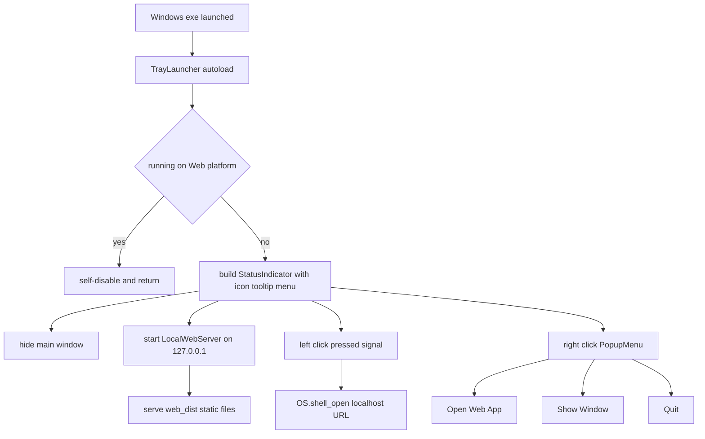

# Tray Launcher Module — Plan

## Goal

Add a **separate launcher module** to LocalStoport:

1. New **Windows Executable** export preset alongside the existing Web preset.
2. On launch (desktop only), the app **minimizes to tray** using Godot's built-in [`StatusIndicator`](scripts/tray/tray_launcher.gd) node (available since Godot 4.5; project targets 4.7).
3. Left-clicking the tray icon starts/serves the exported web build (`web_dist/`) from a tiny built-in HTTP server and opens `http://127.0.0.1:<port>` in the default browser — fully offline, no Python needed.

## Architecture



## New Files

### 1. [`scripts/tray/local_web_server.gd`](scripts/tray/local_web_server.gd)

Minimal static HTTP/1.1 server built on `TCPServer` (no threads needed):

- `start(port_hint: int, root: String) -> int` — binds to `127.0.0.1` (loopback avoids Windows firewall prompts); returns bound port or `-1`.
- `_process()` — `poll()`, accept clients, buffer until `\r\n\r\n`, parse the `GET <path>` request line, respond, close.
- Routing: `/` → `/index.html`; strip query strings; reject any path containing `..`; serve only files under the configured root.
- MIME map (critical for WASM): `.html` → `text/html`, `.js` → `text/javascript`, `.wasm` → `application/wasm`, `.pck` → `application/octet-stream`, plus `.png/.svg/.json/.ico`.
- Response headers: `HTTP/1.1 200 OK`, `Content-Type`, `Content-Length`, `Connection: close`; `404` for missing files.
- Root resolution order (done by caller, passed in): `<exe_dir>/web_dist/` → `res://web_dist/`.

### 2. [`scripts/tray/tray_launcher.gd`](scripts/tray/tray_launcher.gd)

Autoload orchestrator (`extends Node`):

- `_ready()`:
  - Bail out (`set_process_mode(DISABLED)` + free) when `OS.has_feature("web")` or `ClassDB.class_exists("StatusIndicator")` is false — keeps the Web export untouched.
  - Resolve content root: `OS.get_executable_path().get_base_dir() + "/web_dist/"` if it exists, else `res://web_dist/`.
  - Start server with port scan starting at `17400` (a few candidates).
  - **Single-instance guard**: if the primary port is already taken, assume an instance is running → just `OS.shell_open(url)` and `get_tree().quit()`.
  - Build UI in code: `StatusIndicator` with `icon = load("res://icon.svg")`, `tooltip = "LocalStoport"`, and a `PopupMenu` (`Open Web App`, `Show Window`, `---`, `Quit`).
  - Defer window hide by one frame (`await get_tree().process_frame`) then `get_window().hide()` — true minimize-to-tray.
- Signal wiring:
  - `StatusIndicator.pressed(pos, MOUSE_BUTTON_LEFT)` → `OS.shell_open("http://127.0.0.1:%d" % port)`.
  - PopupMenu ids → open browser / `get_window().show()` + `move_to_foreground()` / stop server + `get_tree().quit()`.
- Intercept the window close button: connect `get_window().close_requested` → `hide()` instead of quitting (classic tray-app behavior).

### 3. Config constants

Port base, web dir name, tooltip text live as `const`s at the top of [`tray_launcher.gd`](scripts/tray/tray_launcher.gd) — no separate config file needed for this scope.

## Modified Files

### 4. [`project.godot`](project.godot)

Register the autoload (after existing ones):

```ini
TrayLauncher="*res://scripts/tray/tray_launcher.gd"
```

### 5. [`export_presets.cfg`](export_presets.cfg)

Append `[preset.1]` — Windows Desktop:

- `name="Windows Exe"`, `platform="Windows Desktop"`, `runnable=true`
- `export_path="build/windows/LocalStoport.exe"`
- `binary_format/architecture="x86_64"`, `binary_format/embed_pck=true`
- `include_filter="web_dist/**"` — packs the web build into the exe so it is a **single self-contained file**
- `application/product_name="LocalStoport"`, icon left as project default (a real `.ico` can be added later)
- Codesigning off (unsigned local tool)

Note: embedding `web_dist/` roughly doubles exe size (~+40 MB). Runtime still prefers a sibling `web_dist/` folder if present, so users can swap builds without re-exporting.

### 6. [`README.md`](README.md)

New "Windows launcher" section: how to build (`--export-release "Web"` into `web_dist/`, then `"Windows Exe"`), tray behaviors, port info.

## Edge Cases Covered

| Case | Handling |
|---|---|
| Web export runs module | Platform check disables it entirely |
| Port already in use | Scan next ports; occupied base port ⇒ second instance ⇒ open browser + exit |
| Path traversal (`../`) | Rejected before file access |
| Wrong MIME breaks WASM | Explicit extension→MIME map |
| Close button kills tray app | `close_requested` hides instead |
| Startup flicker | Window hidden one frame after ready |

## Verification Checklist

1. Editor run (F5) on Windows: window hides, tray icon appears, left-click opens browser at served app, right-click menu Open/Show/Quit all work.
2. Launch exe twice: second instance opens browser and exits immediately.
3. Browser loads WASM correctly (progress bar completes — proves MIME types OK).
4. `godot --headless --path . --export-release "Web" web_dist/index.html` still works unchanged.
5. `godot --headless --path . --export-release "Windows Exe" build/windows/LocalStoport.exe` produces a runnable exe.

## Implementation Todos

- [ ] Write `scripts/tray/local_web_server.gd`
- [ ] Write `scripts/tray/tray_launcher.gd`
- [ ] Register `TrayLauncher` autoload in `project.godot`
- [ ] Append `[preset.1]` Windows Desktop preset to `export_presets.cfg`
- [ ] Update `README.md`
- [ ] Manual verification pass (checklist above)
